# NCFE LMS — User Guide

Welcome. This guide covers everything you need to use the NCFE LMS as an admin, assessor, student/learner, or IQA. Read the relevant role section, refer to the Workflows section for the assessment lifecycle, and use the Reference + FAQ when you hit a question.

---

## Section 1 — Overview

### What is NCFE LMS?

NCFE LMS is a Next.js + MongoDB Learning Management System for vocational qualifications. It supports four roles and the full assessment lifecycle from learner onboarding through to IQA sign-off.

### The data model in plain English

```
Centre  ─────────► Qualification ─────────► Unit ─────────► Learning Outcome ─────────► Assessment Criterion
                                                                                                  │
                                                                                                  ▼
   User ◄───────── Enrolment ─────────────────────────────────────────────────────► Assessment ◄─ Evidence
   (Role)                                                                                ▲
                                                                                          │
                                                                                  IQA Sample → Decision
```

- **Centre** — your organisation. Every user belongs to one.
- **Qualification** — a course (e.g. *NCFE Level 3 Certificate in Assessing Vocational Achievement*).
- **Unit / Learning Outcome / Assessment Criterion** — the curriculum tree (`Unit → LO → AC`).
- **User** — has a `role` (`student` / `assessor` / `iqa` / `admin`) and a `status` (`active` / `inactive`).
- **Enrolment** — links a student to a qualification + an assessor + a cohort.
- **Assessment** — created by an assessor for a learner; maps to one or more criteria + one or more pieces of evidence.
- **Evidence** — files the student uploads (PDF, DOCX, image, video, audio).
- **IQA Sample / Decision** — the Internal Quality Assurer samples assessor work and records a decision.

### Production URL

[https://ncfe-lms.onrender.com](https://ncfe-lms.onrender.com)

### Where to get help

- Technical issues / bug reports → contact the centre administrator.
- Forgot password → **contact your administrator** (self-service reset is disabled — admin holds the credentials).
- Feature questions → see the FAQ at the end of this document.

---

## Section 2 — Getting started by role

### 2.1 Sign in (every role)

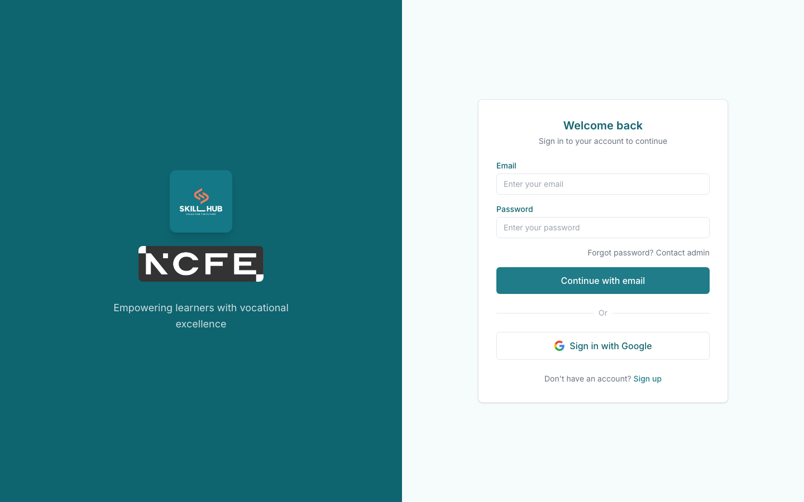

Open [https://ncfe-lms.onrender.com/sign-in](https://ncfe-lms.onrender.com/sign-in), enter your email + password, click **Continue with email**. Each role lands on a different home:

| Role | Lands on |
| --- | --- |
| Admin | `/admin/dashboard` |
| Assessor | `/c` (course list) |
| Student | `/c` (course list) |
| IQA | `/dashboard` (IQA home) |

If you're a **newly-created or password-reset user**, you'll be redirected to **`/profile/change-password`** until you set a new password — this is a security feature so the admin doesn't retain knowledge of your working password.

If you've forgotten your password, the **Forgot password? Contact admin** link on the sign-in page takes you to a contact-administrator notice:

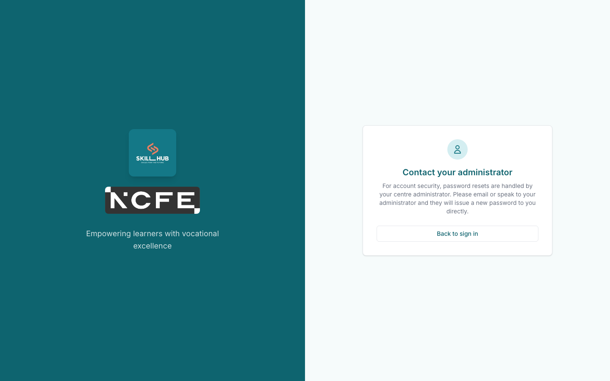

---

### 2.2 Admin

#### Admin home
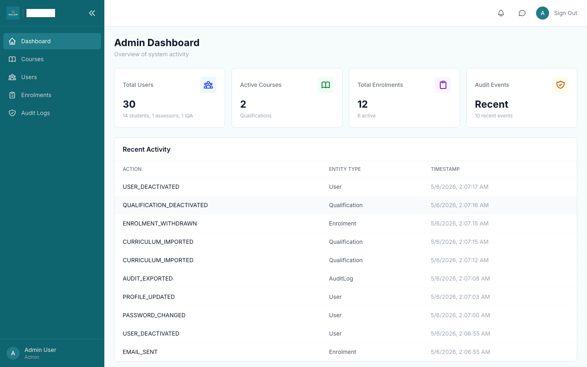

Common tasks:

#### Task — Onboard a new student (combined create + enrol)

1. Navigate to `/admin/users`.
2. Click **Add User** (top right).
3. Fill **Name**, **Email**, leave **Role** as `student`.
4. Click **Generate** to auto-fill a secure 14-character password (or type your own).
5. **Optional but recommended**: in the **Enrolment** section that appears below Role, pick a **Qualification**, an **Assessor**, and a **Cohort**. Filling all three creates the enrolment in the same flow.
6. Click **Create**.
7. The success modal shows **the password**, **email-sent confirmation**, and (if you filled the enrolment fields) **"Enrolled in {course} under {assessor}, cohort {Q}"**.
8. Click **Copy all credentials** to put a 4-line block on your clipboard (Name, Email, Password, Login URL) for handing to the student.

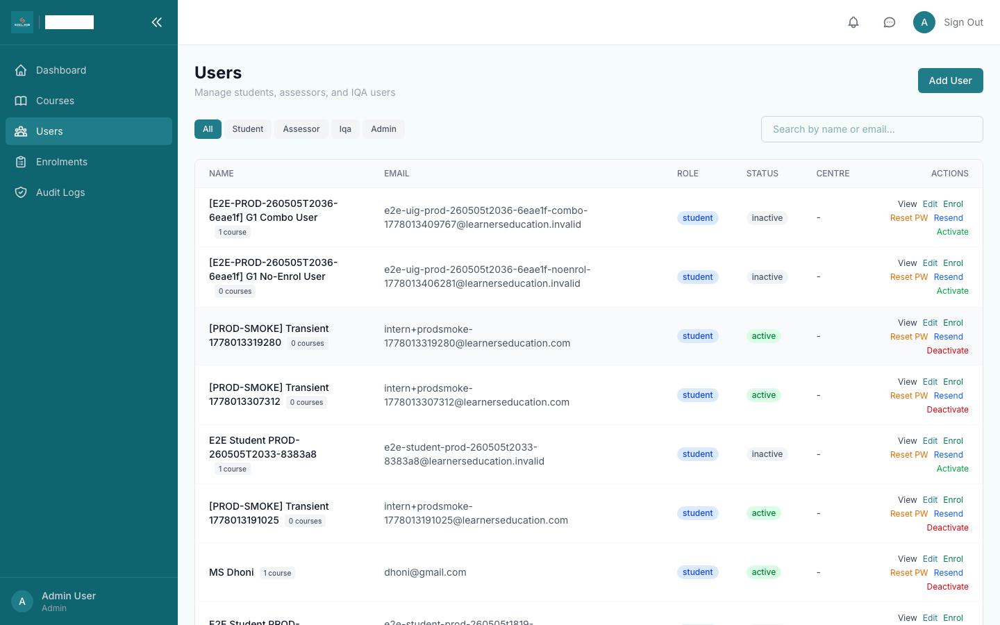

**Common mistake**: filling only one or two of the Qualification / Assessor / Cohort fields. The form blocks the submit with `"fill all three or leave all blank"`. Either complete the enrolment or clear all three.

**If the welcome email fails** (Brevo down, recipient bounced, etc.) the success modal switches from a green check to an amber warning with the failure reason. The user is still created; share the credentials manually and use the **Resend** action on the user's row to retry once email is back.

#### Task — Enrol an existing student in another course

On the `/admin/users` row, click the green **Enrol** action. A modal opens with the same three pickers (Qualification / Assessor / Cohort). Submit. The student gets a "You've been enrolled in {course}" email (if their notification preferences allow).

#### Task — View a student's enrolments

Click the student's name (or **View** button) to open `/admin/users/{id}`. The detail page shows the profile + every enrolment with status, cohort, assessor, and a per-row **Withdraw** action.

#### Task — Manage qualifications

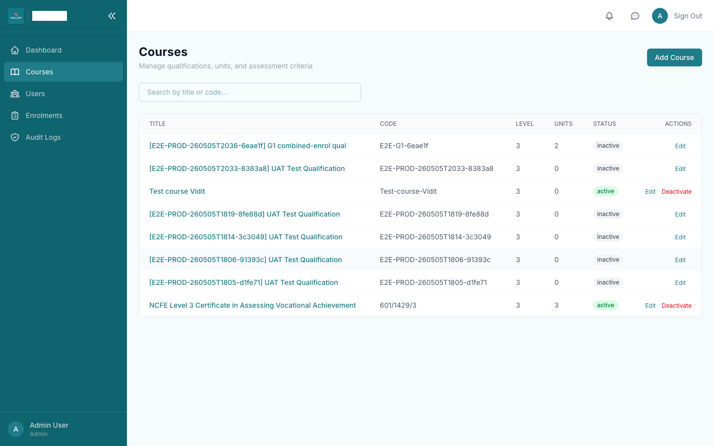

`/admin/courses` lists all qualifications. Click into one to see the curriculum tree. From the detail page you can:
- Add Units / LOs / ACs one at a time
- **Import CSV** — bulk-import the whole tree from a 4–5 column CSV (`Unit Reference, LO Number, AC Number, Description, [Evidence Requirements]`). Click Preview to see the count before committing. Re-importing is fully idempotent (existing rows are skipped, deduped by reference).

#### Task — Audit trail

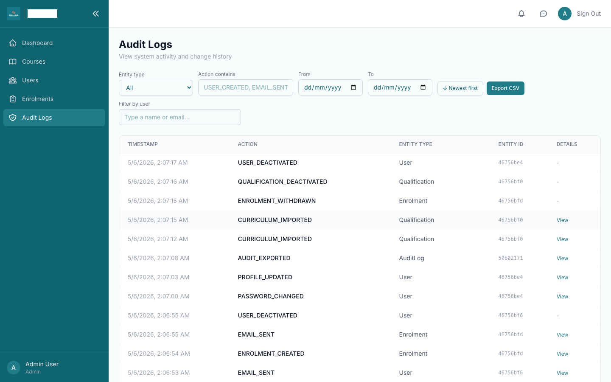

`/admin/audit-logs` shows every meaningful action. Filter by **Entity type**, **Action contains** (substring match — `EMAIL_SENT`, `USER_CREATED`, etc.), **From / To** date range, or **Filter by user** (search-as-you-type). Toggle sort direction. Click **Export CSV** to download the current filtered view.

#### Task — Manage enrolments directly

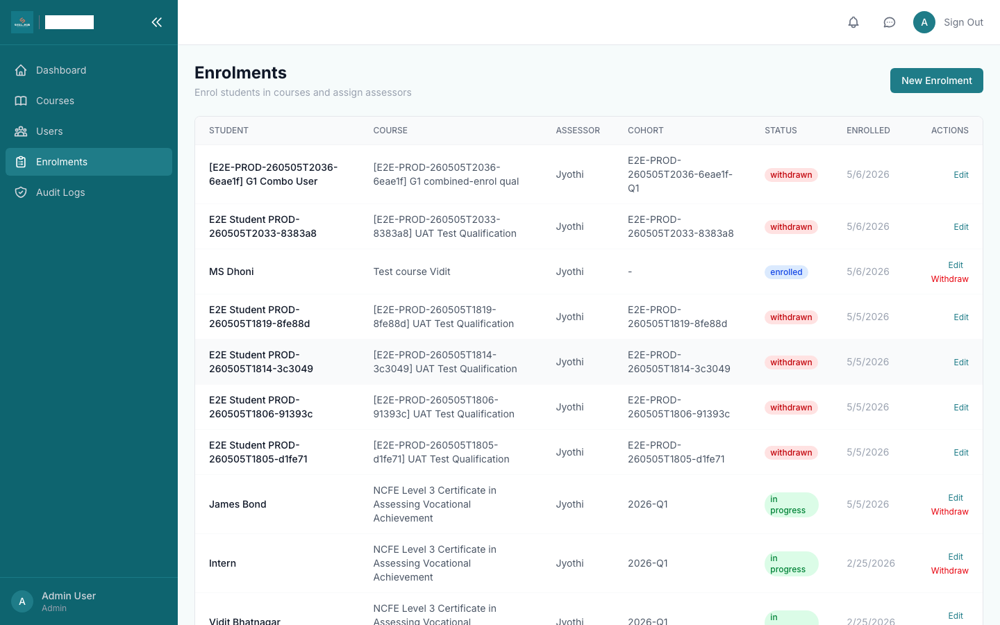

Use `/admin/enrolments` for bulk views and to withdraw enrolments individually.

---

### 2.3 Assessor

#### Assessor home
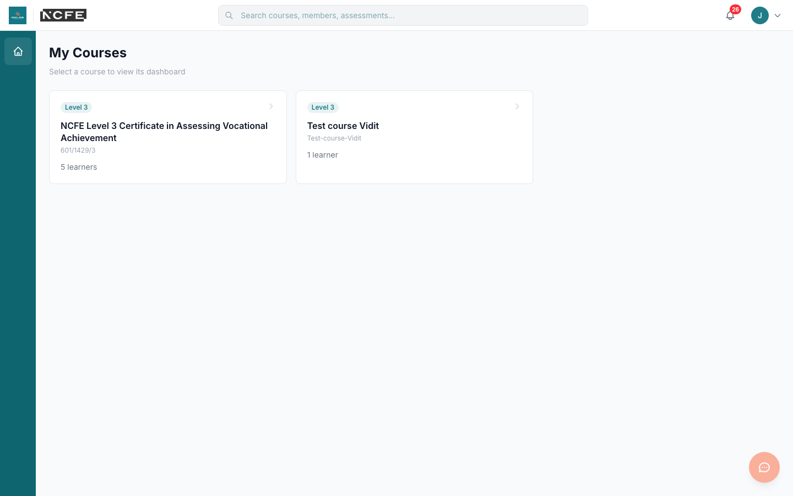

Click a qualification card to enter that course. The course home shows recent assessments, evidence, and materials.

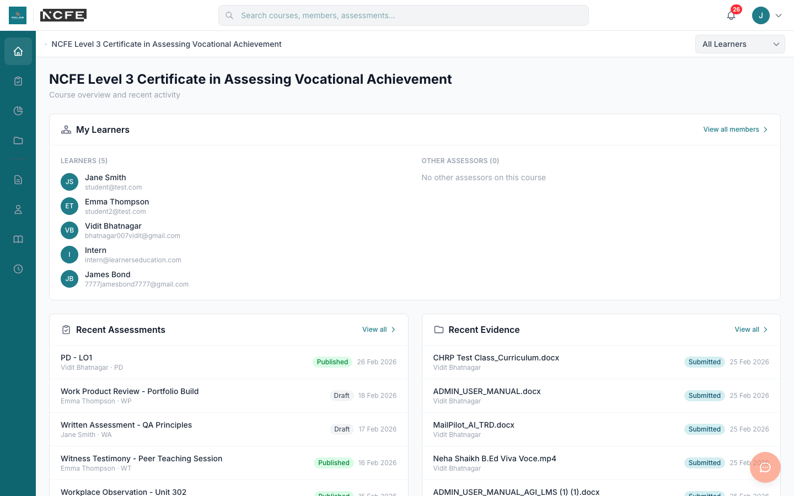

The left sidebar (8 icons) and the Learners dropdown in the top bar are the two main navigation aids:
1. Home
2. Assessment
3. Progress
4. Portfolio
5. *(divider)*
6. Course Documents
7. Personal Documents
8. Materials
9. Work Hours

Common tasks:

#### Task — Plan an assessment

1. Pick a learner from the **Learners ▾** dropdown in the sub-header.
2. Sidebar → **Assessment** → click **+ Create an Assessment**.
3. In the detail panel that slides in from the right, set the title, kind (observation / professional discussion / reflective account / etc.), and fill in plan/intent and plan/implementation.
4. Open the **Criteria Mapping** modal, expand units, tick the criteria this assessment will evidence. Save — the chips render in the panel.

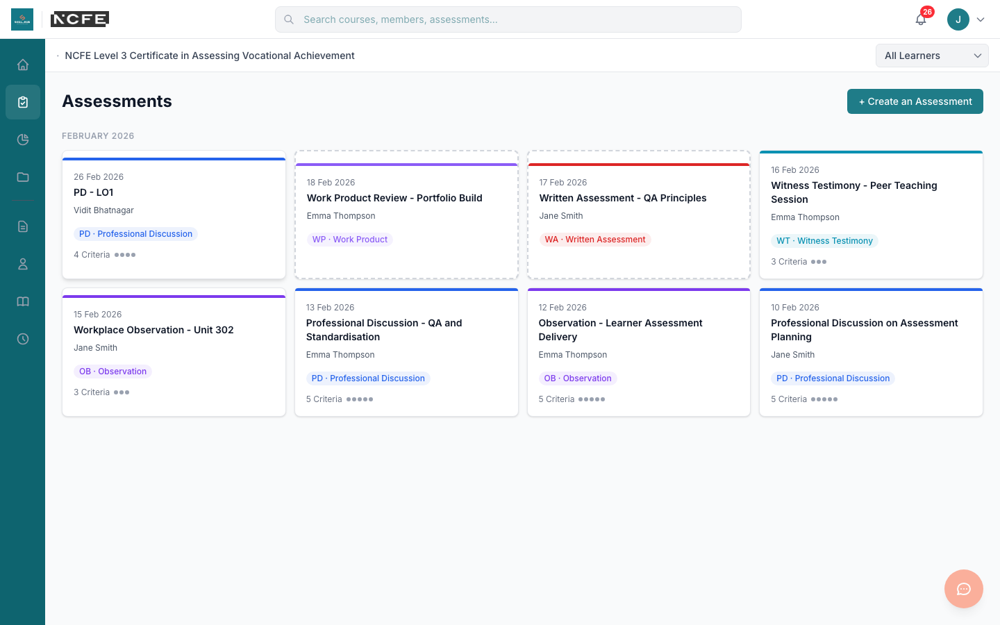

#### Task — Map evidence + sign off

1. Open the assessment.
2. **Evidence Mapping** section — click **Upload Evidence** or pick from the available evidence list to attach.
3. Add a **Remark** if you have feedback.
4. Click **Send to learner** — the assessment moves from `draft` → `published`. The student receives an "Your assessment has been reviewed" email (if their preferences allow) and an in-app notification.

If you re-edit the assessment after publish, status flips to `published_modified` until you re-publish.

#### Task — Review portfolio + progress

 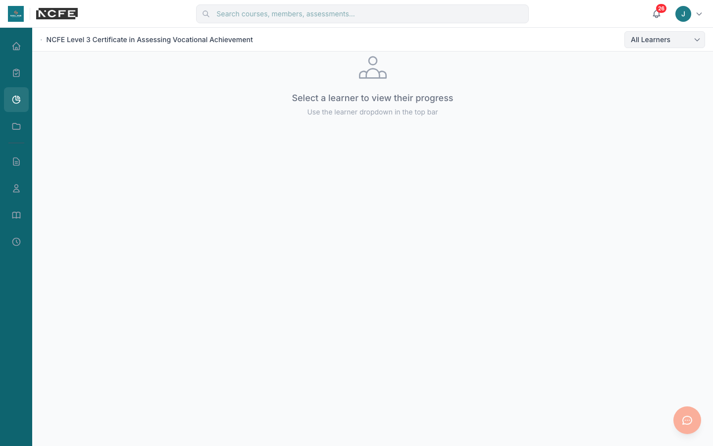

Sidebar → **Portfolio** to see all evidence the selected learner has uploaded. Sidebar → **Progress** for a 4-column drill-down through Units → LOs → Criteria → Assessments showing which criteria are signed off vs outstanding.

---

### 2.4 Student / Learner

#### Student home
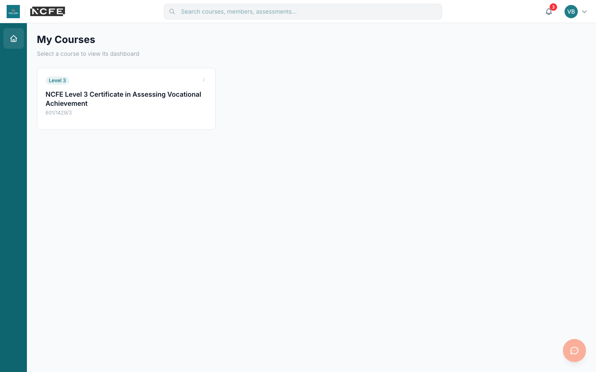

Same `/c` URL as the assessor, but role-aware: students see only their own enrolments.

#### Profile + notification preferences
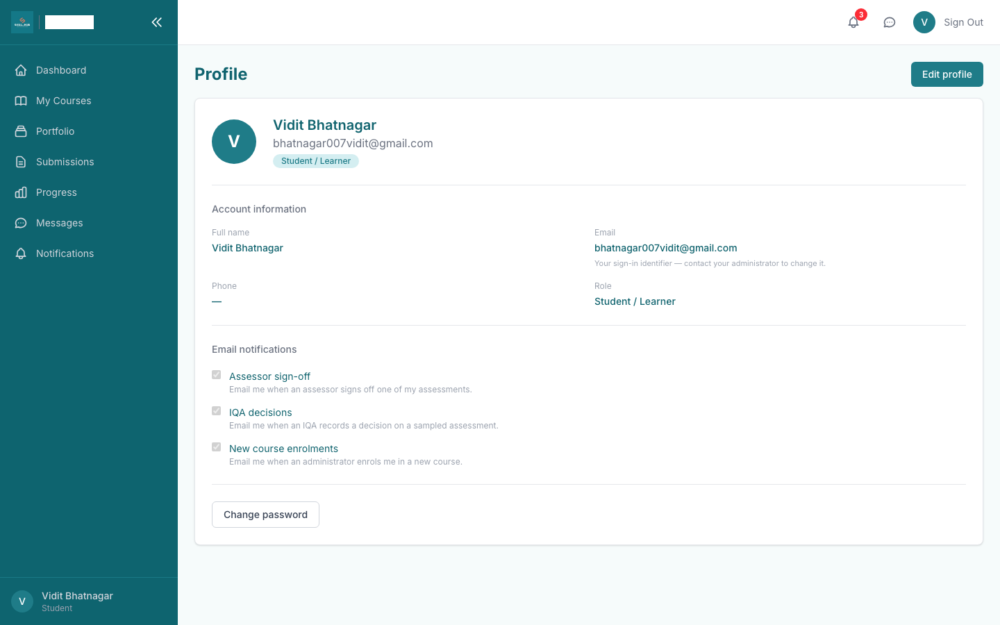

`/profile` lets you:
- Edit name + phone (email is your sign-in identifier and changing it requires admin help).
- Upload an avatar (PNG / JPEG / WEBP / GIF, ≤ 2 MB).
- Toggle email notifications: **Assessor sign-off**, **IQA decisions**, **New course enrolments**.
- Click **Change password** to set a new password any time (current password required).

Common tasks:

#### Task — Upload portfolio evidence

1. Sidebar → **Portfolio**.
2. Click **Upload Evidence**, pick the file, fill a label (e.g. "PDF observation notes"), pick the unit it covers, click upload.
3. The file goes direct to S3 via a presigned URL — large videos (tested up to 144 MB) work without timing out.
4. Once uploaded the evidence row appears with status `draft`. Click **Submit** to flip it to `submitted` so the assessor can map it to an assessment.

#### Task — Sign off an assessment

When the assessor publishes an assessment, you'll see a notification (and an email if you haven't opted out). Open the assessment, review the evidence chips and the assessor's remark, then click the learner sign-off button to confirm.

#### Task — Log work hours

Sidebar → **Work Hours**. Use the day navigator to pick a date, click **+ New**, enter hours + a note. The list shows your daily total at the bottom.

---

### 2.5 IQA (Internal Quality Assurer)

#### IQA home
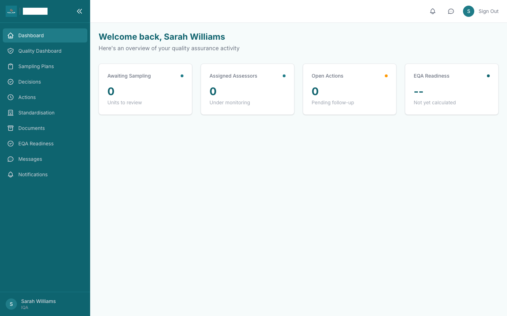

Common tasks:

#### Task — Sample an assessor's work
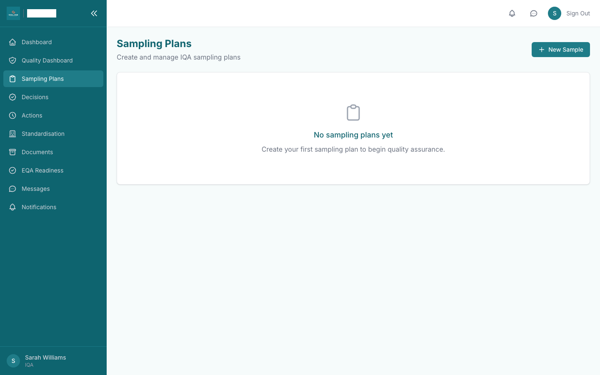

1. `/iqa/sampling` → **+ New Sample**.
2. Pick the assessor + learner + unit + qualification, set the stage (`early` / `mid` / `late`) and the assessment methods sampled.
3. Save.

#### Task — Submit a decision
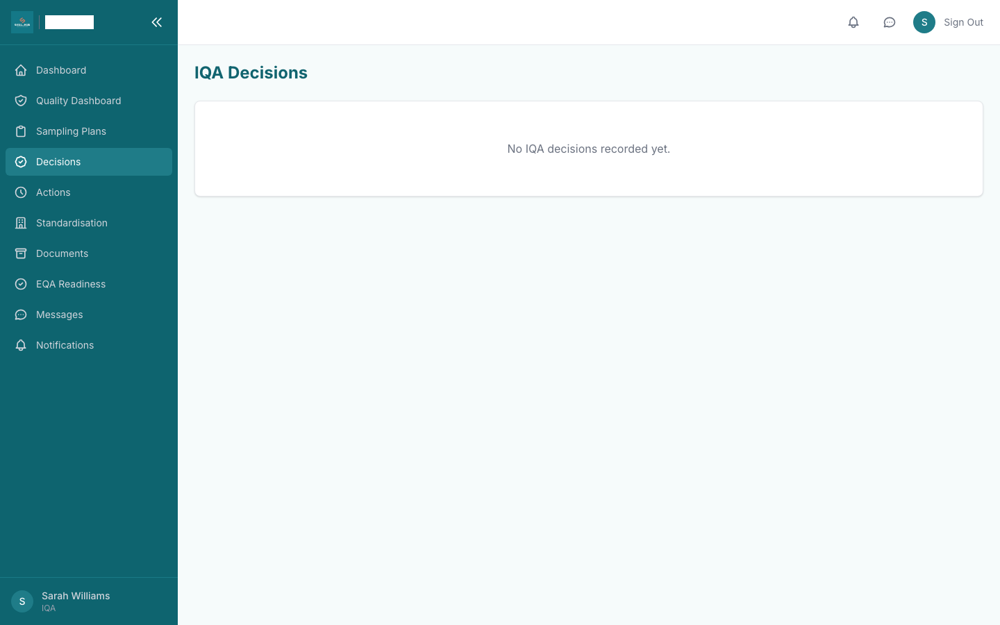

1. Click into a sample → **Submit Decision**.
2. Pick `approved` / `action_required` / `reassessment_required`, write a rationale + (optionally) actions for the assessor.
3. Save. Both the assessor and the learner receive an "IQA decision recorded" email (if their preferences allow). The decision appears on `/iqa/decisions`.

---

## Section 3 — Cross-role workflow walkthrough

The full assessment lifecycle, narrated as a single story:

### 1. Admin onboards a student
Admin opens `/admin/users` → **Add User**, types the student's name + email, clicks **Generate** for a password, picks the qualification + assessor + cohort, submits. The student gets a welcome email with their credentials and a link to sign in.

### 2. Student first login
Student receives the email, clicks **Sign in**, enters credentials. Because the password was admin-issued, they're redirected to **`/profile/change-password`**, set a new password, and land on `/c` (their course list).

### 3. Assessor plans the assessment
Assessor signs in, picks the student from the Learners dropdown, goes to **Assessment**, clicks **+ Create**. Fills title + kind + plan, opens **Criteria Mapping**, ticks 3 criteria across 2 units, saves.

### 4. Student uploads evidence
Student goes to **Portfolio**, uploads a PDF + an image + a 144 MB MP4 recording, labels each, submits them.

### 5. Assessor reviews and signs off
Assessor opens the assessment, opens **Evidence Mapping**, links the 5 pieces of evidence the student submitted, adds a remark "All criteria met, recording is clear", clicks **Send to learner**. Status flips to `published`. The student receives a "Your assessment has been reviewed" email.

### 6. Student signs off
Student opens the assessment in read-only mode, sees the chips + remark, clicks **Sign off**.

### 7. IQA samples + decides
IQA opens `/iqa/sampling`, creates a sample for that assessor + learner + unit, submits a decision (`approved` with comment "Sampled and approved"). Both the assessor and student get an email.

### 8. Admin checks the audit trail
Admin opens `/admin/audit-logs`, filters to today + this student, exports the result as CSV for the centre's quality records.

---

## Section 4 — Reference

### Roles vs permissions matrix

| Capability | Admin | Assessor | Student | IQA |
| --- | --- | --- | --- | --- |
| Sign in | ✅ | ✅ | ✅ | ✅ |
| `/admin/*` | ✅ | — | — | — |
| Create users / qualifications / enrolments | ✅ | — | — | — |
| Reset passwords / resend welcome | ✅ | — | — | — |
| Edit own profile, upload avatar | ✅ | ✅ | ✅ | ✅ |
| Change own password | ✅ | ✅ | ✅ | ✅ |
| **Self-service password reset (forgot)** | — | — | — | — *(disabled — contact admin)* |
| Create assessments | — | ✅ | — | — |
| Map criteria + evidence | — | ✅ | — | — |
| Sign off assessment (assessor sign-off) | — | ✅ | — | — |
| Upload portfolio evidence | — | — | ✅ (own) | — |
| Submit assessment (learner sign-off) | — | — | ✅ (own) | — |
| Log work hours | — | ✅ (for learner) | ✅ (own) | — |
| `/iqa/*` | — | — | — | ✅ |
| Sample assessor work | — | — | — | ✅ |
| Record IQA decision | — | — | — | ✅ |
| View audit logs | ✅ | — | — | — |
| Export audit-log CSV | ✅ | — | — | — |
| Bulk CSV curriculum import | ✅ | — | — | — |

### File upload limits

(Source: `src/lib/upload.ts`)

| | |
| --- | --- |
| **Max single file size** | 2 GB |
| **Allowed extensions (evidence/materials/personal/course docs)** | `.pdf`, `.doc`, `.docx`, `.xls`, `.xlsx`, `.ppt`, `.pptx`, `.txt`, `.png`, `.jpg`, `.jpeg`, `.gif`, `.webp`, `.mp4`, `.mov`, `.avi`, `.mp3`, `.wav`, `.m4a`, `.zip` |
| **Avatar limit** | 2 MB, must be PNG / JPEG / WEBP / GIF |
| **Storage** | AWS S3 bucket `ncfe-lms-files` (region `ap-south-1`); large evidence uploads via presigned URLs |

### Email notification triggers

| Event | Recipient(s) | Template | Honors opt-out? |
| --- | --- | --- | --- |
| Admin creates user | New user | `welcome` | n/a (always-on) |
| Admin resets password | Affected user | `password_reset` | n/a |
| Admin clicks **Resend welcome** | Affected user | `welcome` (with fresh password) | n/a |
| Assessor publishes assessment (draft → published) | Student / learner | `sign_off` | ✅ `notificationPreferences.signOff` |
| IQA submits a decision | Assessor + learner | `iqa_decision` | ✅ `notificationPreferences.iqaDecision` |
| Admin enrols user in a course | Student | `new_enrolment` | ✅ `notificationPreferences.newEnrolment` |

All email failures are **soft-fail** — the originating action (user create, sign-off, decision) always succeeds even if Brevo is down. Failures are recorded in the audit log as `EMAIL_FAILED` with the error message.

### Keyboard shortcuts

None currently implemented.

### Sidebar reference (assessor + student)

The 8 sidebar icons follow the BRITEthink architecture spec — identical for both roles, role-aware behaviour:

1. 🏠 **Home** → `/c/{slug}`
2. ✓ **Assessment** → `/c/{slug}/assessment`
3. 📊 **Progress** → `/c/{slug}/progress`
4. 📁 **Portfolio** → `/c/{slug}/portfolio`
5. 📘 **Course Documents** → `/c/{slug}/course-documents`
6. 🎒 **Personal Documents** → `/c/{slug}/personal-documents`
7. 📚 **Materials** → `/c/{slug}/materials`
8. 🕒 **Work Hours** → `/c/{slug}/work-hours`

---

## Section 5 — FAQ

**Q: How do I add a student to multiple courses?**
A: Two ways. (1) On the user-create form, the Qualification/Assessor/Cohort fields enrol them in one course at create time. To add more, after the user exists go to `/admin/users` and click **Enrol** on their row to open the mini-modal — you can repeat this as many times as you need. (2) Or use the user detail page (`/admin/users/{id}`) and click **+ Add enrolment**.

**Q: I created a user but the welcome email didn't arrive. What went wrong?**
A: Check the success modal. If it shows a green check and `Email sent to ✓`, the email was accepted by Brevo — most likely it's in spam (single-sender Brevo verification doesn't guarantee inbox placement until domain authentication is set up). Check the audit log for `EMAIL_SENT` or `EMAIL_FAILED`. If failed, the user was still created — share the credentials manually using **Copy all credentials** in the success modal, or click **Resend** on the user row.

**Q: A student says they forgot their password. What do I do?**
A: Self-service password reset is disabled by design. Open `/admin/users`, click **Reset PW** on their row, click **Generate** for a new password, submit. The success modal shows the new password — copy it and share it with the student. They'll be required to change it again on their next sign-in.

**Q: A student opened the link in the welcome email but is stuck on a "Change your password" screen. Is something wrong?**
A: No, that's correct. Admin-issued passwords always require a change on first login so the admin doesn't retain knowledge of the user's working password. The student fills the form (current = the admin-issued password, new = whatever they choose), submits, and is signed back into the normal flow.

**Q: What happens when I delete a user?**
A: Admin **delete** is a **soft delete** by design — it sets `status: inactive` and keeps the row for audit recovery. The user can no longer sign in, but their assessments / evidence / enrolments remain so the audit trail stays intact. To re-activate, edit the user and switch status back to `active`.

**Q: Can I delete the James Bond demo account?**
A: **No.** The James Bond demo (`7777jamesbond7777@gmail.com`) is the canonical demo account. Deleting it will break the demo workflow and several test fixtures.

**Q: How do I bulk-import a qualification's curriculum?**
A: On `/admin/courses/{id}`, click **Import CSV**. Provide a CSV with columns `Unit Reference, LO Number, AC Number, Description, [Evidence Requirements]` (header row optional). The dialog has a **Preview** button that shows expected counts before committing. Re-importing the same CSV is safe — duplicates are deduped server-side by reference.

**Q: Why do some users have "n courses" badges and others don't?**
A: The badge only renders for `student`-role users. Assessors / IQA / admin don't have enrolments in the same sense, so the chip is hidden.

**Q: A user asked to opt out of email notifications. How?**
A: They open `/profile`, click **Edit profile**, and toggle off any of the three checkboxes (Assessor sign-off / IQA decisions / New course enrolments). The next event of that type will skip them.

**Q: The audit log is huge. How do I find what changed yesterday between 2pm and 4pm?**
A: `/admin/audit-logs` → set **From** = yesterday and **To** = yesterday (the API includes the entire end day). Add an Action filter (e.g. `USER_CREATED`) or pick a specific user via the **Filter by user** search. Click **Export CSV** if you want the result for offline review.

**Q: Brevo says "Email failed" because the recipient bounced. Can I retry?**
A: Click **Resend** on the user row. That generates a fresh password, updates the user, and re-sends the welcome email. If Brevo is back up the new send goes through.

**Q: How do I change the email sender display name (e.g. from "NCFE LMS" to "Centre Name LMS")?**
A: Edit the `BREVO_SENDER_NAME` env var on Render → service → Environment tab and save. Render auto-redeploys. The verified sender mailbox doesn't change — only the display name does.

**Q: Where do screenshots in this guide come from?**
A: Captured directly from production by running `CAPTURE_SCREENSHOTS=1 npx playwright test --config=playwright.prod.config.ts --grep "capture screenshots"`. They live under `docs/screenshots/`.

---

For the full per-page audit, see [`tests/UI_AUDIT.md`](../tests/UI_AUDIT.md).
For the production verification report, see [`tests/UI_GAPS_REPORT.md`](../tests/UI_GAPS_REPORT.md).
For the launch demo brief, see [`tests/DEMO_SUMMARY.md`](../tests/DEMO_SUMMARY.md).
